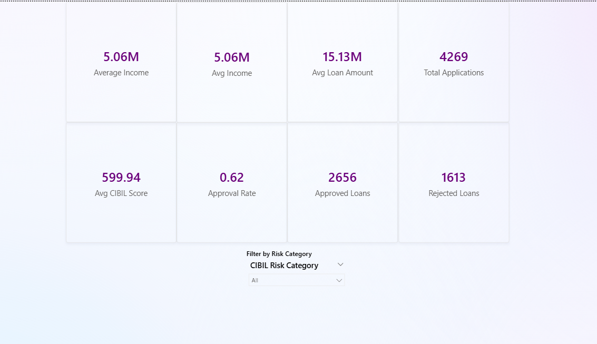

# Power-BI-Loan-Portfolio-Risk-Dashboard

This project analyzes borrower creditworthiness and loan approval behavior using Power BI.

Key Insights:

Higher CIBIL score applicants show stronger approval probability
Asset strength significantly influences loan sanction decisions
Medium-income borrowers demonstrate the highest approval stability

Tools Used:

Power BI
DAX
Data Cleaning
Risk Segmentation Analytics
## 📷 Dashboard Preview

